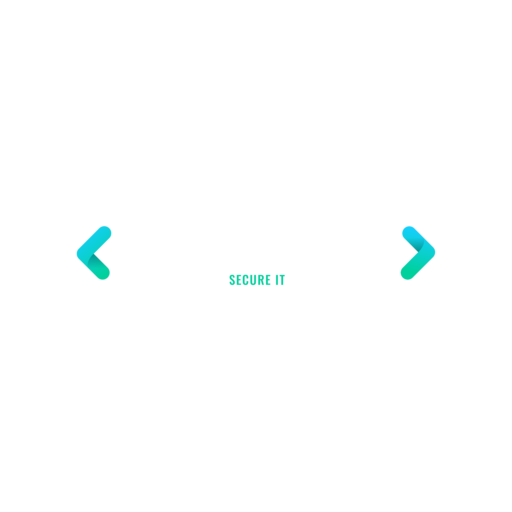

<!--
*** Thanks for checking out the Best-README-Template. If you have a suggestion
*** that would make this better, please fork the repo and create a pull request
*** or simply open an issue with the tag "enhancement".
*** Thanks again! Now go create something AMAZING! :D
***
***
***
*** To avoid retyping too much info. Do a search and replace for the following:
*** brianangulo, bruteforcerer, twitter_handle, bangulo219@gmail.com, Brute Force It, Fun Website that lets you test your password against the brute forcing algorithm
-->


<!-- PROJECT SHIELDS -->
<!--
*** I'm using markdown "reference style" links for readability.
*** Reference links are enclosed in brackets [ ] instead of parentheses ( ).
*** See the bottom of this document for the declaration of the reference variables
*** for contributors-url, forks-url, etc. This is an optional, concise syntax you may use.
*** https://www.markdownguide.org/basic-syntax/#reference-style-links
-->


<!-- PROJECT LOGO -->
<br />
<p align="center">
  <a href="https://github.com/brianangulo/bruteforcerer">
    
  </a>

  <h3 align="center">Brute Force It</h3>

  <p align="center">
    Fun Website that lets you test your password against the brute forcing algorithm
    <br />
    <br />
    <a href="https://bruteforceit.netlify.app/">View Live</a>
    ·
    <a href="https://github.com/brianangulo/bruteforcerer/issues">Report Bug</a>
    ·
    <a href="https://github.com/brianangulo/bruteforcerer/issues">Request Feature</a>
  </p>
</p>


<!-- TABLE OF CONTENTS -->
<details open="open">
  <summary><h2 style="display: inline-block">Table of Contents</h2></summary>
  <ol>
    <li>
      <a href="#about-the-project">About The Project</a>
      <ul>
        <li><a href="#built-with">Built With</a></li>
      </ul>
    </li>
    <li>
      <a href="#getting-started">Getting Started</a>
      <ul>
        <li><a href="#prerequisites">Prerequisites</a></li>
        <li><a href="#installation">Installation</a></li>
      </ul>
    </li>
    <li><a href="#usage">Usage</a></li>
    <li><a href="#roadmap">Roadmap</a></li>
    <li><a href="#contributing">Contributing</a></li>
    <li><a href="#license">License</a></li>
    <li><a href="#contact">Contact</a></li>
    <li><a href="#acknowledgements">Acknowledgements</a></li>
  </ol>
</details>


<!-- ABOUT THE PROJECT -->
## About The Project


### Built With

* [React.js](https://reactjs.org/)
* [Node.js](https://nodejs.org/en/)
* [Bootstrap](https://getbootstrap.com/docs/4.0/getting-started/introduction/)
* [Redux](https://redux.js.org/)


<!-- GETTING STARTED -->
## Getting Started

To get a local copy up and running follow these simple steps.


### Installation

1. Clone the repo
   ```sh
   git clone https://github.com/brianangulo/bruteforcerer.git
   ```
2. Install NPM packages
   ```sh
   npm install
   ```
   or yarn 
   
    ```sh
   yarn
   ```

3. Run dev server
   ```sh
   npm start
   ```
   or yarn 
   
    ```sh
   yarn start
   ```


<!-- ROADMAP -->
## Roadmap

See the [open issues](https://github.com/brianangulo/bruteforcerer/issues) for a list of proposed features (and known issues).


<!-- CONTRIBUTING -->
## Contributing

Contributions are what make the open source community such an amazing place to be learn, inspire, and create. Any contributions you make are **greatly appreciated**.

1. Fork the Project
2. Create your Feature Branch (`git checkout -b feature/AmazingFeature`)
3. Commit your Changes (`git commit -m 'Add some AmazingFeature'`)
4. Push to the Branch (`git push origin feature/AmazingFeature`)
5. Open a Pull Request


<!-- LICENSE -->
## License

No license as of yet


<!-- CONTACT -->
## Contact

Your Name - [@twitter_handle](https://twitter.com/twitter_handle) - bangulo219@gmail.com

Project Link: [https://github.com/brianangulo/bruteforcerer](https://github.com/brianangulo/bruteforcerer)
